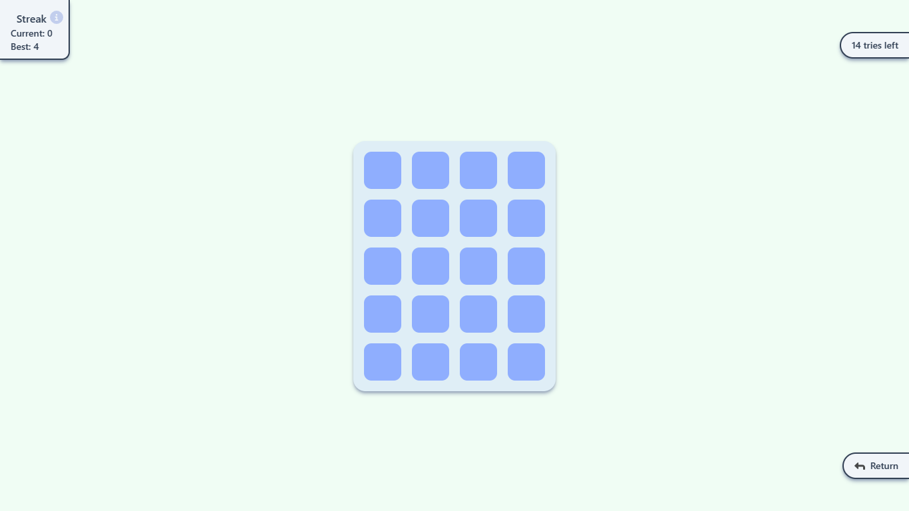

# Memory Game

## About

What you can do:

- Select game difficulty level
- Select single or multiplayer
- Peek tiles at the start of the game
- Store highscore or streak in localStorage

I also added some cool animations to increase the overall user experience!

## Technologies used

React, Tailwind, GSAP

### Screenshot

### Links

- Live Site URL: [guessing card game](https://guessing-card-game.vercel.app/)

### Built with

- Vite
- Mobile-first workflow
